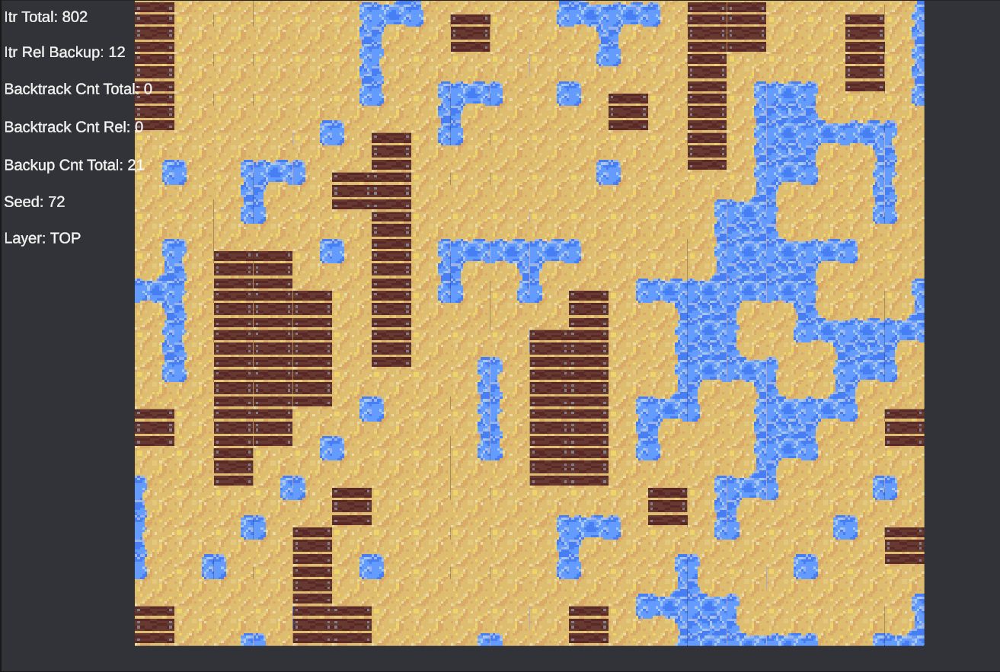
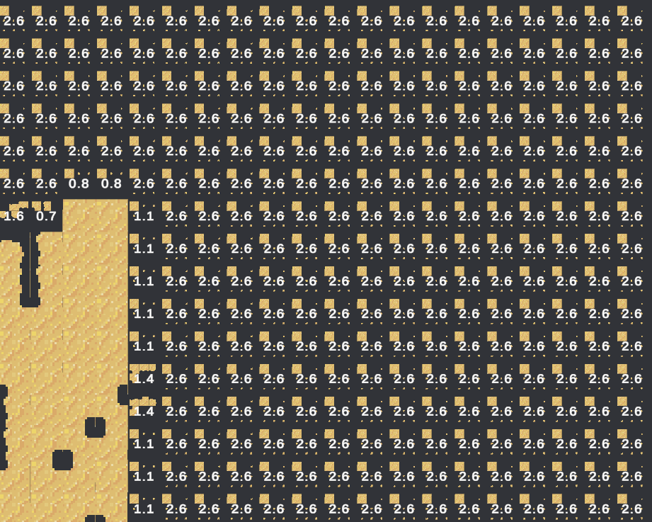

Wave Function Collapse
========================

# About the Project

This project implements the Wave Function Collapse (WFC) algorithm in Unity using a tile grid approach. All tile assets were hand-designed using custom pixel art created specifically for this system.

To enhance the flexibility and reduce the number of handcrafted tiles required, I developed a multi-layer approach. This custom method allows for more complex and varied outputs while minimizing the need to manually design a large number of individual tile combinations. It balances visual diversity with development efficiency, making the system more scalable for larger or more detailed environments.

# Tile Rules & Layer Interactions
Each tile in the system has a manually defined rule set that governs which tiles it can connect to and on which sides. For example, a horizontal land tile may only connect to sand tiles on its left and right edges. To streamline this process, a helper script was created to automatically determine valid tile connections and their orientations. Additionally, certain tiles influence other layers: a sand tile with empty space beneath it will trigger the generation of a water tile on a lower layer, while a solid sand tile might prompt the top layer to generate planks. Tiles are also assigned weights, giving finer control over their visual frequency and allowing for more curated and intentional design results.

# Tile set

# Sample Generation

# Debug system
The project includes a simple but effective debug system to help visualize how the Wave Function Collapse algorithm operates. For any given layer, it displays the set of possible tiles that can still be placed at each node. These tiles are scaled based on their likelihood of being selected, giving a quick visual cue about the current tile probabilities. Additionally, each node's entropy (representing the value of valid options remaining).

# Generation Demo

# Unit Tests
Unit tests were written for core components like the nodes and tile data to ensure the system behaves as expected and remains reliable as it evolves.

# Possible Ideas for the future
- Use Unity’s DOTS/ECS for parallelism and performance.
- Add a smoothing step to reduce noise and eliminate small patches.
